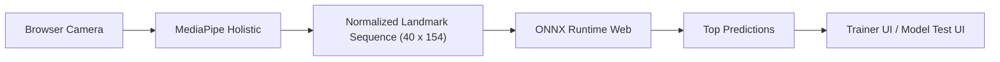
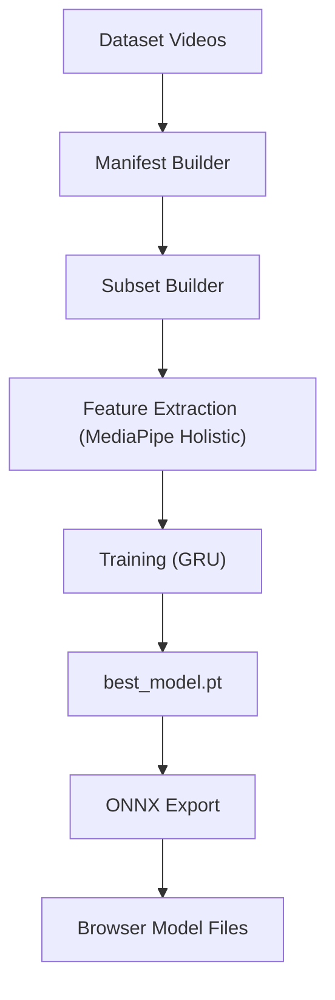

# Architecture

## 1. High-level overview

The project has two main parts:

- a browser runtime for live sign recognition
- a Python pipeline for dataset preparation and model training

The current production path for the web UI looks like this:

That means:

- raw video stays in the browser
- landmarks are extracted in the browser
- inference runs in the browser
- no Python server is required for the website itself

## 2. Web layer

### 2.1 Pages

- [`index.html`](/D:/Integration-Game/gesture-trainer-web/index.html)  
  Main guided training experience.

- [`model-test.html`](/D:/Integration-Game/gesture-trainer-web/model-test.html)  
  Lightweight live-inference and diagnostics page.

Both pages load:

- `onnxruntime-web`
- `@mediapipe/holistic`
- `@mediapipe/drawing_utils`

### 2.2 Shared browser runtime

Main module:

- [`js/sign-model-runtime.js`](/D:/Integration-Game/gesture-trainer-web/js/sign-model-runtime.js)

Responsibilities:

- loading the ONNX model and metadata
- creating the `ort.InferenceSession`
- softmax and prediction ranking
- converting `left hand + right hand + upper pose` landmarks into feature vectors
- normalizing coordinates relative to body center and shoulder scale
- starting the camera with multiple fallbacks
- drawing results on the output canvas

### 2.3 Feature vector layout

Each frame produces `154` features:

- `21 * 3 = 63` for the left hand
- `21 * 3 = 63` for the right hand
- `7 * 4 = 28` for the selected pose landmarks

Total:

- `63 + 63 + 28 = 154`

Model sequence length:

- `40` frames

Model input shape:

- `[1, 40, 154]`

## 3. Trainer UI

Main logic:

- [`js/gesture-trainer.js`](/D:/Integration-Game/gesture-trainer-web/js/gesture-trainer.js)

What the trainer does:

- loads model labels from metadata
- selects the current target sign
- buffers the most recent `40` feature vectors
- runs the model and reads predictions
- shows top predictions
- calculates hold progress for the current target
- provides instructional hints and live coaching

### 3.1 Coaching and diagnostics

The trainer includes:

- camera diagnostics
- visibility coaching
- zone-aware hints
- a sign guide card
- an SVG gesture preview

Examples of live coaching:

- signer is not visible enough
- face is missing from the frame
- both hands are required
- hand is too close to the frame edge
- sign is being shown in the wrong zone

### 3.2 Target zones

For some signs, the trainer expects a reasonable performance area:

- face or mouth level
- upper chest
- torso or waist
- neutral signing space

This does not change the model itself, but it improves UX:

- fewer confusing false failures
- clearer feedback
- better guidance when a user performs the sign in the wrong place

## 4. Model Test UI

File:

- [`js/model-test.js`](/D:/Integration-Game/gesture-trainer-web/js/model-test.js)

This page is intentionally simpler than the trainer.

It is useful for:

- verifying that the model loads
- checking the camera
- inspecting top predictions
- smoke-testing after swapping ONNX files

## 5. Model

### 5.1 Source

The browser model is exported from a PyTorch checkpoint:

- ONNX: [`models/asl_citizen_50.onnx`](/D:/Integration-Game/gesture-trainer-web/models/asl_citizen_50.onnx)
- metadata: [`models/asl_citizen_50_metadata.json`](/D:/Integration-Game/gesture-trainer-web/models/asl_citizen_50_metadata.json)

### 5.2 Training-time architecture

Original training architecture:

- landmark sequence encoder
- GRU classifier
- softmax over sign classes

Training script:

- [`python/train_sign_model.py`](/D:/Integration-Game/gesture-trainer-web/python/train_sign_model.py)

### 5.3 Why this approach was chosen

This is a practical compromise between:

- training speed
- dataset size
- deployment simplicity
- realism for a webcam sign demo

Why not a heavy video CNN:

- more expensive to train
- slower for extraction and iteration
- less convenient for a fast prototype cycle

Why not only rule-based finger logic:

- it does not scale well to real signed words
- a temporal landmark model is a stronger baseline for isolated sign recognition

## 6. Python pipeline

The Python side is for offline dataset and model work.

Main files:

- [`python/build_asl_citizen_manifest.py`](/D:/Integration-Game/gesture-trainer-web/python/build_asl_citizen_manifest.py)
- [`python/build_wlasl_manifest.py`](/D:/Integration-Game/gesture-trainer-web/python/build_wlasl_manifest.py)
- [`python/prepare_wlasl_subset.py`](/D:/Integration-Game/gesture-trainer-web/python/prepare_wlasl_subset.py)
- [`python/extract_sign_features.py`](/D:/Integration-Game/gesture-trainer-web/python/extract_sign_features.py)
- [`python/train_sign_model.py`](/D:/Integration-Game/gesture-trainer-web/python/train_sign_model.py)
- [`python/export_sign_model_onnx.py`](/D:/Integration-Game/gesture-trainer-web/python/export_sign_model_onnx.py)

Pipeline:

## 7. Legacy local backend

File:

- [`python/local_inference_server.py`](/D:/Integration-Game/gesture-trainer-web/python/local_inference_server.py)

This backend is still useful as:

- a debugging tool
- a way to test raw PyTorch checkpoints before ONNX export
- a source for the older `/api/health` and `/api/predict` flow

But it is not the primary runtime path for the current website.

## 8. Why GitHub Pages now works

Previously, inference depended on a Python API, so GitHub Pages alone was not enough.

Now:

- inference runs in the browser
- the model is stored as a static `onnx` file
- metadata is a static `json` file
- the UI is pure HTML, CSS, and JS

That is why GitHub Pages and Netlify are now valid deployment targets.

The only important distinction:

- they work for browser inference
- they do not run PyTorch or FastAPI for you

