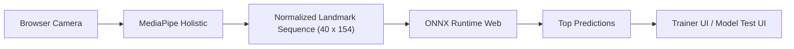
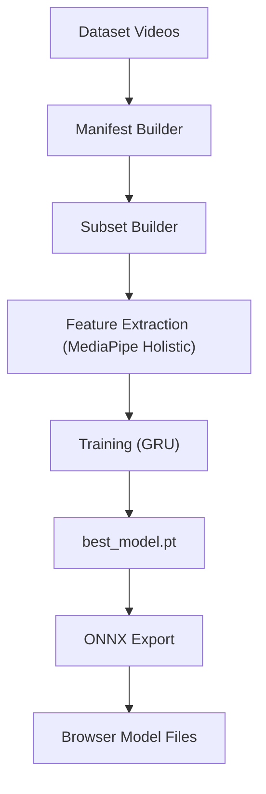

# Architecture

## 1. Общая схема

Проект состоит из двух логических частей:

- браузерный runtime для live sign recognition
- Python pipeline для подготовки и обучения модели

Сейчас продакшеновый путь для UI выглядит так:

То есть:

- raw video остаётся в браузере
- landmarks извлекаются в браузере
- inference идёт в браузере
- Python-сервер для сайта не нужен

## 2. Веб-слой

### 2.1 Страницы

- [`index.html`](/D:/Integration-Game/gesture-trainer-web/index.html)  
  Основной trainer с guided practice.

- [`model-test.html`](/D:/Integration-Game/gesture-trainer-web/model-test.html)  
  Минимальный стенд для live inference и диагностики.

Обе страницы подключают:

- `onnxruntime-web`
- `@mediapipe/holistic`
- `@mediapipe/drawing_utils`

### 2.2 Общий runtime

Главный модуль:

- [`js/sign-model-runtime.js`](/D:/Integration-Game/gesture-trainer-web/js/sign-model-runtime.js)

Он отвечает за:

- загрузку ONNX-модели и metadata
- подготовку `ort.InferenceSession`
- softmax и ранжирование предсказаний
- сбор feature vector из `left hand + right hand + upper pose`
- нормализацию landmarks относительно центра корпуса и масштаба плеч
- запуск камеры с несколькими fallback constraints
- отрисовку поверх video/canvas

### 2.3 Как устроен feature vector

Один кадр даёт `154` признака:

- `21 * 3 = 63` для левой руки
- `21 * 3 = 63` для правой руки
- `7 * 4 = 28` для подмножества pose landmarks

Итого:

- `63 + 63 + 28 = 154`

Последовательность модели:

- длина окна: `40` кадров
- вход модели: `[1, 40, 154]`

## 3. Trainer UI

Основная логика trainer находится в:

- [`js/gesture-trainer.js`](/D:/Integration-Game/gesture-trainer-web/js/gesture-trainer.js)

Что делает trainer:

- загружает label names из metadata
- выбирает текущий target sign
- буферизует `40` последних feature vectors
- считает предсказания модели
- показывает top predictions
- считает hold progress для текущего target
- даёт обучающие подсказки и коучинг

### 3.1 Коучинг и диагностика

В trainer встроены:

- camera diagnostics
- coaching messages по видимости
- zone-aware hints
- guide card с описанием знака
- SVG gesture preview

Примеры сообщений:

- signer плохо виден
- лицо не попало в кадр
- нужен обе руки
- рука слишком близко к краю
- знак показан не в той зоне

### 3.2 Target zones

Для некоторых знаков trainer ограничивает “разумную” зону исполнения:

- face / mouth level
- upper chest
- torso / waist
- neutral space

Это не меняет саму модель, но улучшает UX:

- меньше ложных “почему не засчитало”
- понятнее обратная связь
- легче понять, что пользователь делает не так

## 4. Model Test UI

Файл:

- [`js/model-test.js`](/D:/Integration-Game/gesture-trainer-web/js/model-test.js)

Это упрощённая страница без механики тренировки.

Она нужна для:

- проверки загрузки модели
- проверки камеры
- просмотра top predictions
- smoke tests после замены ONNX-файлов

## 5. Модель

### 5.1 Источник

Браузерная модель экспортирована из PyTorch checkpoint:

- ONNX: [`models/asl_citizen_50.onnx`](/D:/Integration-Game/gesture-trainer-web/models/asl_citizen_50.onnx)
- metadata: [`models/asl_citizen_50_metadata.json`](/D:/Integration-Game/gesture-trainer-web/models/asl_citizen_50_metadata.json)

### 5.2 Архитектура

Исходная train-time архитектура:

- landmark sequence encoder
- GRU classifier
- softmax по классам

Файл обучения:

- [`python/train_sign_model.py`](/D:/Integration-Game/gesture-trainer-web/python/train_sign_model.py)

### 5.3 Почему выбран такой подход

Это компромисс между:

- скоростью обучения
- размером данных
- простотой deployment
- реалистичностью для webcam sign demo

Почему не video CNN:

- тяжелее вычислительно
- дольше на extraction/training
- сложнее для быстрого iterative workflow

Почему не rule-based fingers:

- они плохо масштабируются на реальные словарные знаки
- temporal model с landmarks лучше подходит для isolated sign recognition

## 6. Python pipeline

Python часть нужна для оффлайн-работы с датасетом.

Главные файлы:

- [`python/build_asl_citizen_manifest.py`](/D:/Integration-Game/gesture-trainer-web/python/build_asl_citizen_manifest.py)
- [`python/build_wlasl_manifest.py`](/D:/Integration-Game/gesture-trainer-web/python/build_wlasl_manifest.py)
- [`python/prepare_wlasl_subset.py`](/D:/Integration-Game/gesture-trainer-web/python/prepare_wlasl_subset.py)
- [`python/extract_sign_features.py`](/D:/Integration-Game/gesture-trainer-web/python/extract_sign_features.py)
- [`python/train_sign_model.py`](/D:/Integration-Game/gesture-trainer-web/python/train_sign_model.py)
- [`python/export_sign_model_onnx.py`](/D:/Integration-Game/gesture-trainer-web/python/export_sign_model_onnx.py)

Пайплайн:

## 7. Legacy local backend

Файл:

- [`python/local_inference_server.py`](/D:/Integration-Game/gesture-trainer-web/python/local_inference_server.py)

Этот backend сохраняется как:

- вспомогательный debug tool
- способ быстро проверить PyTorch checkpoint до экспорта
- источник старого `/api/health` и `/api/predict`

Но он не является основным путём для текущего сайта.

## 8. Почему GitHub Pages теперь подходит

Раньше inference шёл через Python API, и GitHub Pages был недостаточен.

Сейчас:

- inference браузерный
- модель лежит как статический `onnx`
- metadata — обычный `json`
- UI — чистый HTML/CSS/JS

Поэтому GitHub Pages и Netlify подходят.

Ограничение только одно:

- это работает для browser inference
- но не для PyTorch/FastAPI backend

